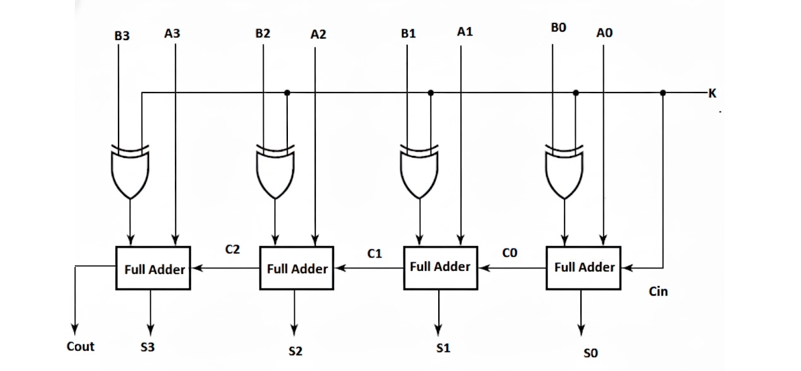

### 1-bit Half Adder

#### Circuit Diagram

_Figure 1: Half Adder circuit diagram showing XOR gate for Sum output and AND gate for Carry output. Reference: Theory section_

#### Components Required

- 1 XOR gate
- 1 AND gate

#### Circuit Connections

1. Drag the XOR gate and connect its inputs with A and B inputs. Also, connect its output with the Sum output bit.
2. Drag the AND gate and connect its inputs with A and B inputs. Also, connect its output with the Carry output bit.
3. Click on "Simulate" and observe the values of Sum and Carry for different input values of A and B.

#### Observations

- The Sum bit shows the sum of A and B binary bits, while the Carry bit displays the carry of the sum of A and B.
- If the circuit has been made as described above, a "Success" message will be displayed upon clicking "Submit".

### 1-bit Full Adder

#### Circuit Diagram

_Figure 2: Full Adder circuit diagram showing 2 XOR gates, 2 AND gates, and 1 OR gate to handle carry input. Reference: Theory section_

#### Components Required

- 2 XOR gates
- 2 AND gates
- 1 OR gate

#### Circuit Connections

1. Drag the first XOR gate and connect its inputs with A and B inputs.
2. Drag the second XOR gate and connect its inputs with the CarryIn input bit and the output point of the first XOR gate. Connect its output point with the Sum output bit.
3. Drag the first AND gate and connect its inputs with the CarryIn input bit and the output point of the first XOR gate.
4. Drag the second AND gate and connect its inputs with A and B inputs.
5. Drag the OR gate and connect its inputs with the output points of the two AND gates. Connect its output point with the CarryOut output bit.
6. Click on "Simulate" and observe the values of Sum and Carry for different input values of A, B, and CarryIn.

#### Observations

- The Sum bit shows the sum of A, B, and CarryIn binary bits, while the CarryOut bit displays the carry of the sum of A, B, and CarryIn.
- If the circuit has been made as described above, a "Success" message will be displayed upon clicking "Submit".

### 4-bit Ripple Carry Adder

#### Circuit Diagram

_Figure 3: 4-bit Ripple Carry Adder circuit diagram showing 4 full adders connected in series with carry propagation. Reference: Theory section_

#### Components Required

- 4 1-bit Full Adders

#### Circuit Connections

1. Drag the first Full Adder and connect its A₀ and B₀ input points with A₀ and B₀ input bits. Connect its Cin input point with the CarryIn input bit and Sum output point with the Sum₀ output bit.
2. Drag the second Full Adder and connect its A₀ and B₀ input points with A₁ and B₁ input bits. Connect its Cin input point with the Cout output point of the first Full Adder and Sum output point with the Sum₁ output bit.
3. Drag the third Full Adder and connect its A₀ and B₀ input points with A₂ and B₂ input bits. Connect its Cin input point with the Cout output point of the second Full Adder and Sum output point with the Sum₂ output bit.
4. Drag the fourth Full Adder and connect its A₀ and B₀ input points with A₃ and B₃ input bits. Connect its Cin input point with the Cout output point of the third Full Adder and Sum output point with the Sum₃ output bit.
5. Connect the CarryOut output bit with the Cout output point of the fourth Full Adder and click on "Simulate".

#### Observations

- The binary sum of two 4-bit numbers A₃A₂A₁A₀ and B₃B₂B₁B₀, along with carry CarryIn, is observed as Sum₃ Sum₂ Sum₁ Sum₀ with carry CarryOut.
- If the circuit has been made as described above, a "Success" message will be displayed upon clicking "Submit".

### 4-bit Adder-Subtractor

#### Circuit Diagram

_Figure 4: 4-bit Adder-Subtractor circuit diagram showing 4 full adders with XOR gates for 2's complement operation controlled by mode input M. Reference: Theory section_

#### Components Required

- 4 1-bit Full Adders
- 4 XOR gates (for 2's complement conversion)
- 1 Mode control input (M)

#### Circuit Connections

1. Connect the Mode control input M to the Cin of the first Full Adder (this provides the +1 for 2's complement).
2. For each bit position i (where i = 0, 1, 2, 3):
   - Connect Aᵢ input directly to the Aᵢ input of the i-th Full Adder.
   - Connect Bᵢ input to one input of the i-th XOR gate.
   - Connect Mode control M to the other input of the i-th XOR gate.
   - Connect the output of the i-th XOR gate to the Bᵢ input of the i-th Full Adder.
3. Connect the carry output of each Full Adder to the carry input of the next Full Adder (same as ripple carry adder).
4. Connect the Sum outputs of each Full Adder to the corresponding Sum output bits (Sum₀, Sum₁, Sum₂, Sum₃).
5. Connect the final carry output to the CarryOut/Overflow output.
6. Set Mode control M:
   - M = 0 for addition operation (A + B)
   - M = 1 for subtraction operation (A - B)
7. Click on "Simulate" and observe the results for different input values and mode settings.

#### Observations

- When M = 0 (Addition mode): The circuit performs normal binary addition A + B, producing Sum₃ Sum₂ Sum₁ Sum₀ and CarryOut.
- When M = 1 (Subtraction mode): The circuit performs subtraction A - B by computing A + (2's complement of B), producing Difference₃ Difference₂ Difference₁ Difference₀ and overflow indication.
- The XOR gates conditionally invert the B inputs when M = 1, and the Mode input provides the +1 needed for 2's complement conversion.
- If the circuit has been made as described above, a "Success" message will be displayed upon clicking "Submit".
